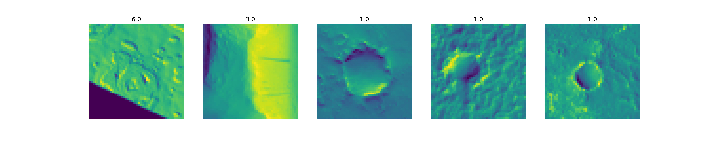

### Nasa Mars Images
1. Train a CNN to classify these images
2. Train a LTCN to classify these images
3. Use LTCN on minimal hardware (maybe for a robotics implementation?)



### Dataset: `hirise-map-proj-v3_2`
If you don't want to run `prepare_data.py` and transform the data into a csv yourself, you 
can download the transformed dataset here: https://huggingface.co/datasets/lukasnxyz/nasa-mars-images
* Original dataset source: https://data.nasa.gov/Space-Science/Mars-orbital-image-HiRISE-labeled-data-set-version/egmv-36wq/about_data
* Download link original dataset: https://zenodo.org/records/4002935/files/hirise-map-proj-v3_2.zip?download=1
* MLA Citation: Gary Doran, et al. Mars Orbital Image (hirise) Labeled Data Set Version 3.2. 3.2.0, Zenodo, 16 Sept. 2020, doi:10.5281/zenodo.4002935.
* Paper related to this research: https://arxiv.org/pdf/2102.05011 

### Quickstart
To install requirements:
```bash
python3 -m venv venv
source venv/bin/activate
pip3 install -r requirements.txt
```

Load and prepare data: `mkdir data/` and download the data set from the original link, then run `prepare_data.py`.
